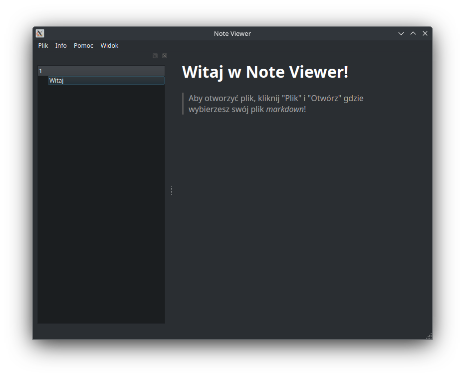

# Note Viewer
> Aplikacja której potrzebuje każdy.



# Instrukcja instalowania
## Arch Linux
1. Idź do [releases](https://github.com/Pix3lM0on/note-viewer/releases)
2. Pobierz `noteviewer.pkg.tar.zst`
3. Otwórz terminal i nawiguj do folderu gdzie znajduje się pobrany plik. Najczęściej jest to `~/Downloads`:
   ```bash
   cd ~/Downloads
   ```
4. Uruchom komendę:
   ```bash
   sudo pacman -U noteviewer.pkg.tar.zst
   ```
